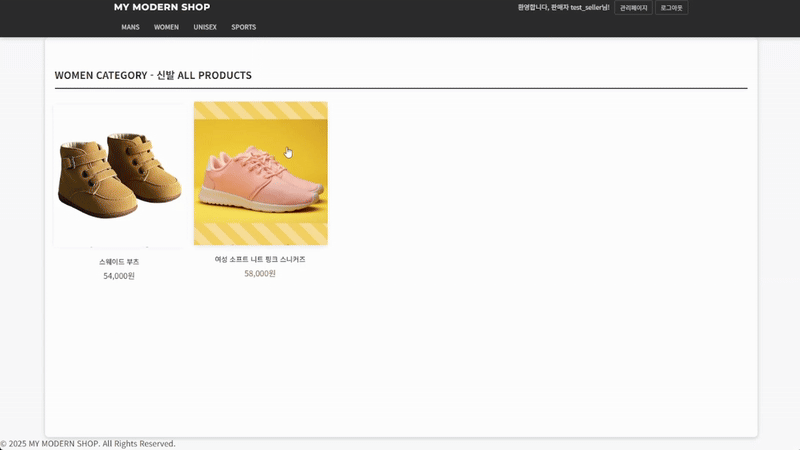
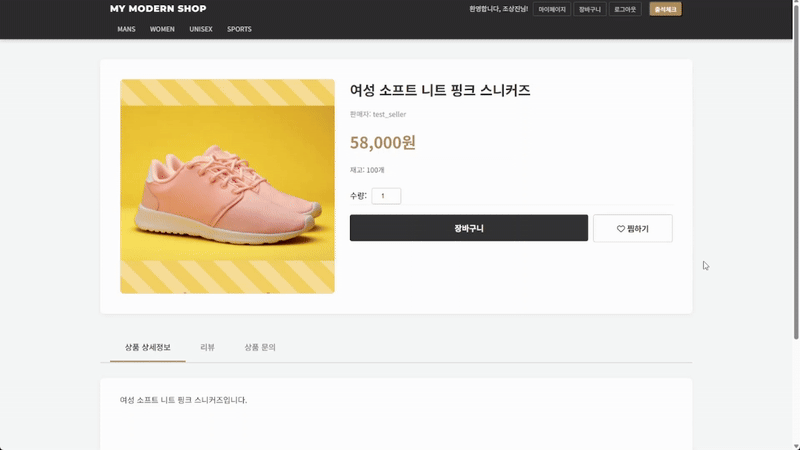
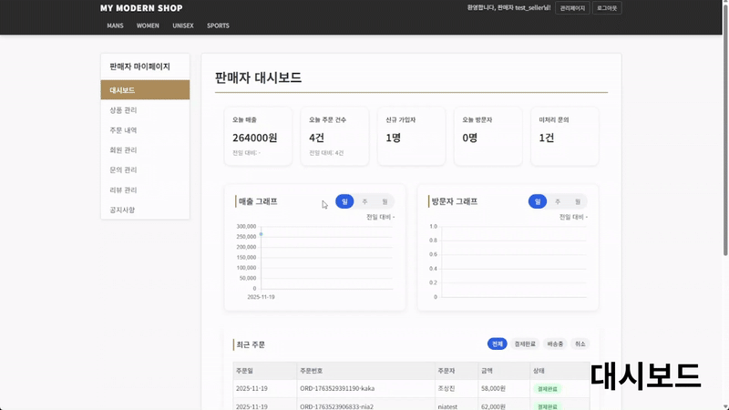
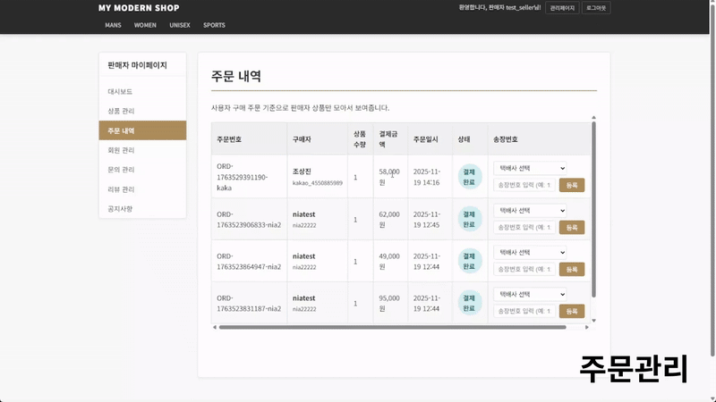
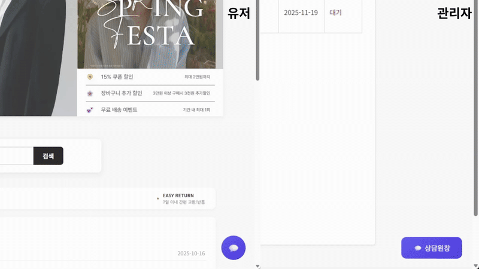

# 🛒 Boot Sales Platform (Spring Boot E-Commerce)

> **상품 탐색부터 주문·결제, 상담까지 한 흐름으로 제공하는 이커머스 플랫폼**

Boot Sales Platform은 사용자가 상품을 쉽게 탐색하고, 찜하기·문의·결제 등 주요 기능을 직관적으로 이용할 수 있도록 구성된 **통합 이커머스 서비스**입니다.

관리자는 대시보드와 주문 관리 기능을 통해 상품과 주문 현황을 효율적으로 운영할 수 있도록 설계되었습니다.

[마이그레이션 전 프로젝트 링크](https://github.com/CSJ-094/boot_car_recall_final.git)


---

## 🛠 Tech Stack

### 🌐 프론트엔드
| 기술 | 설명 |
|:--:|:--|
|  | 서버 사이드 렌더링 기반 동적 페이지 구성 |
|  <br>  | UI 마크업 및 스타일링 |
|  <br>  | 사용자 인터랙션 및 Ajax 통신 처리 |
|  | 반응형 UI 컴포넌트 기반 화면 구성 |

---

### 🧩 백엔드
| 기술 | 설명 |
|:--:|:--|
|  | 백엔드 핵심 언어 및 서버 로직 구현 |
|  | MVC 기반 웹 애플리케이션 / REST API 구성 |
|  | 인증·인가 및 권한 기반 접근 제어 |
|  | SQL 중심 데이터 처리 및 동적 쿼리 매핑 |
|  | 웹 애플리케이션 구동 환경 |

---

### 🗄️ 데이터베이스 & 외부 연동
| 기술 | 설명 |
|:--:|:--|
|  | 상품·주문 등 핵심 데이터 관리 |
|  | 관계형 데이터 저장 및 조회 |
|  | 채팅 로그 등 메시지성 데이터 저장 |
|  | AI 상담(상품 문의 응답) |
|  | 결제 승인 및 위변조 검증 |

---

### 🤝 협업 & 도구
| 기술 | 설명 |
|:--:|:--|
|  | 형상 관리 및 협업 |
|  | 문서화 및 일정 관리 |
|  | 이슈 및 작업 관리 |
|  | 팀 커뮤니케이션 |

---
## 📁 Project Structure (프로젝트 폴더 구조)

본 프로젝트는 **Spring Boot 기반 웹 애플리케이션**으로, 서버 사이드 렌더링(JSP)과 정적 리소스 분리를 고려한 구조를 따르고 있습니다.
- MVC 패턴에 맞춘 **역할별 패키지 분리**
- JSP 템플릿과 정적 리소스(css/js/img) 분리로 유지보수 용이
- MyBatis Mapper와 비즈니스 로직 명확히 분리
- 관리자/사용자/상품/주문 도메인 구조가 한눈에 파악 가능

```bash
Product-sales-platform-boot/
├─ src/
│  ├─ main/
│  │  ├─ java/
│  │  │  └─ com.boot
│  │  │     ├─ config/            # Spring Security, Web 설정
│  │  │     ├─ controller/        # MVC Controller
│  │  │     ├─ dao/               # MyBatis DAO
│  │  │     ├─ domain/            # Entity / Domain 객체
│  │  │     ├─ dto/               # DTO
│  │  │     ├─ OpenAiClient/      # OpenAI API 연동 로직
│  │  │     └─ service/           # 비즈니스 로직
│  │  │
│  │  ├─ resources/
│  │  │  ├─ mybatis/
│  │  │  │  ├─ mapper/            # MyBatis Mapper XML
│  │  │  │  └─ mappers/
│  │  │  ├─ templates/            # JSP 템플릿
│  │  │  │  ├─ cart/
│  │  │  │  ├─ category/
│  │  │  │  ├─ find/
│  │  │  │  ├─ fragments/         # header, footer 공통 레이아웃
│  │  │  │  ├─ login/
│  │  │  │  ├─ order/
│  │  │  │  ├─ product/
│  │  │  │  ├─ seller/
│  │  │  │  └─ user/
│  │  │  ├─ static/
│  │  │  │  ├─ css/               # 페이지별 CSS
│  │  │  │  ├─ img/               # 이미지 리소스
│  │  │  │  └─ js/                # JS (차트, 채팅, 대시보드)
│  │  │  ├─ application.properties
│  │  │  ├─ mybatis-config.xml
│  │  │  └─ keystore.p12          # HTTPS 인증서
│  │
│  └─ test/                       # 테스트 코드
│
├─ build.gradle                   # Gradle 빌드 설정
├─ settings.gradle
├─ gradlew / gradlew.bat
└─ README.md
```
<br/>

---
## ✨ Key Features

### 👤 회원 관리 (Member)
- **회원가입 / 로그인**  
  Spring Security 기반 폼 로그인 및 보안 설정 적용
- **권한 제어**  
  일반 사용자(USER) / 관리자(ADMIN) 권한 분리
- **AI 상담 챗봇**  
  GPT-4o-mini를 활용한 상품 문의 자동 응답
- **실시간 상담 채팅**  
  WebSocket 기반 1:1 실시간 채팅 지원  
  채팅 로그는 MongoDB에 비동기 저장

---

### 🛍 상품 관리 (Item)
- **상품 등록 / 수정**  
  관리자 권한 사용자만 상품 이미지 및 상세 정보 관리 가능
- **상품 조회**  
  페이징 처리 및 검색 기능을 통한 상품 목록 제공

---

### 🛒 주문 시스템 (Cart & Order)
- **장바구니**  
  상품 담기 및 수량 변경 기능 제공
- **주문 / 결제**  
  Toss Payments API 연동을 통한 실제 결제 프로세스 구현
- **주문 내역 관리**  
  주문 기록 조회 및 주문 취소 기능 제공

---

### 👑 관리자 기능 (Admin Side)
- **관리자 전용 백오피스**  
  ROLE_ADMIN 권한 계정만 접근 가능
- **상품 관리**
  - 상품명, 가격, 상세 설명, 재고 수량 설정  
  - 다중 상품 이미지 업로드 및 대표 이미지 지정  
  - 상품 상태 관리 (판매 중 / 품절)
- **재고 관리**  
  주문 및 취소 시 실시간 재고 증감 처리
- **주문 현황 관리**  
  전체 주문 내역을 대시보드 형태로 조회 및 관리
- **통합 상담 센터**  
  상담 요청 목록 확인 및 실시간 1:1 채팅 응대
- **보안**  
  RBAC(Role Based Access Control) 기반 관리자 기능 접근 제어


## ERD


<details>
  <summary><b>📋 테이블 세부 명세서 보기</b></summary>
  <br>


</details>

## 📂 Project Documents (기타 문서)

프로젝트 진행 시 작성된 설계 문서입니다. 클릭 시 상세 내용을 확인할 수 있습니다.

| 문서 종류 | 파일명 | 형식 | 바로가기 |
| :--- | :--- | :---: | :---: |
| **화면 설계서** | 화면설계서.pdf |  | [📄 문서 보기](https://github.com/user-attachments/files/24488584/default.pdf) |
| **서비스구조** | 테이블명세서.xls |   | [📄 문서 보기](https://github.com/user-attachments/files/24488677/default.pdf) |

<br/>

## UI/UX Screenshot

### 유저 전용 UI

<details>
  <summary>메인 화면</summary>
  <br>

  

  - **구조**  
    ItemController → ItemService → ItemRepository (QueryDSL)

  - **핵심 로직**
    - **동적 검색**: QueryDSL을 활용해 상품명, 상품 상태, 등록자 조건별 검색 기능 구현
    - **페이징 처리**: Pageable 인터페이스를 사용해 대량 데이터 분할 조회
    - **이미지 최적화**: 대표 이미지(`repImgYn = 'Y'`)만 조회하여 메인 리스트에 노출
</details>


<details>
  <summary>상품 상세페이지</summary>
  <br>

  <div style="display:flex; gap:20px;">
    

  </div>
  
 - **구조**
    - Item ↔ ItemImg : 1:N 매핑으로 상품 기본 정보 + 이미지 리스트를 함께 구성
    - ItemDetail 화면 내 탭 구성(상세/리뷰/문의)로 기능을 분리하여 제공

  - **핵심 로직**
    - **상품 상세 조회**
      - 상품 ID(`itemId`)를 경로 변수로 받아 상품 정보와 등록된 이미지 목록을 함께 조회합니다.
      - **재고 상태 처리**: 재고 수량을 확인해 `품절`이면 `주문하기` 버튼을 비활성화합니다.
    - **상품 문의**
      - 상품 상세 페이지에서 **문의 탭**을 통해 문의를 등록/조회할 수 있습니다.
      - **등록**: 로그인 사용자 기준으로 제목/내용을 저장하고, 상품 ID와 함께 매핑합니다.
      - **조회**: 상품 ID 기준으로 해당 상품의 문의 목록을 조회하여 화면에 표시합니다.
</details>


<details>
  <summary>찜하기(wishlist)</summary>
  <br>

  

  - **구조**
    - User ↔ Item : 사용자별 찜 목록을 관리하는 관계로 구성
    - 상품 상세 화면에서 찜 상태를 토글할 수 있도록 UI와 기능을 연결

  - **핵심 로직**
    - **찜 등록/해제**
      - 하트 버튼 클릭 시 찜 상태를 토글하며, 이미 찜한 상품이면 해제 처리합니다.
      - 로그인 사용자 기준으로 찜 정보를 저장/삭제하여 사용자별 목록을 분리합니다.
    - **중복 방지**
      - 동일 사용자-상품 조합은 중복 저장되지 않도록 처리합니다.
</details>


<details>
  <summary>상품 구매(결제) 페이지</summary>
  <br>

  

  - **구조**
    - OrderController → OrderService → Toss Payments API

  - **핵심 로직**
    - **주문 생성**
      - 결제 요청 시 주문 정보를 생성하고 트랜잭션 범위 내에서 재고를 차감합니다.
      - `Item.removeStock()` 호출 시 재고 부족하면 `OutOfStockException`을 발생시켜 전체 주문을 롤백합니다.
    - **결제 검증**
      - 프론트엔드에서 전달된 결제 금액과 서버 DB에 저장된 실제 상품 금액을 비교 검증합니다.
      - 검증이 완료된 경우에만 Toss Payments API를 호출하여 최종 결제 승인을 처리합니다.
</details>


<details>
  <summary>마이페이지</summary>


- 구조: OrderRepository에서 현재 로그인한 사용자의 email로 필터링 조회

- 핵심 로직:

    주문 이력: 본인이 주문한 내역을 최신순으로 페이징 조회합니다.

    배송 상태: OrderStatus 상수를 정의하여 ORDER, CANCEL, SHIPPING, DELIVERED 단계를 추적합니다.

    주문 취소: 배송 시작 전(ORDER 상태)에만 취소가 가능하도록 검증 로직이 포함되어 있습니다.
</details>


### 관리자 전용 UI

<details>
  <summary>관리자 대시보드</summary>
  <br>

  

  - **구조**
    - AdminDashboardController → AdminDashboardService → Repository(통계/집계 쿼리)
    - 주문/회원/상품 등 주요 데이터를 집계하여 카드형 지표 + 차트 형태로 시각화

  - **핵심 로직**
    - **핵심 지표 집계**
      - 전체 주문 수, 매출, 신규 회원 수 등 관리자 핵심 지표를 집계하여 대시보드 상단에 표시합니다.
    - **기간/조건 기반 조회**
      - 일/주/월 단위(또는 기간 조건)로 통계 데이터를 조회하여 차트에 반영합니다.
    - **운영 편의 기능**
      - 대시보드에서 주요 관리 화면(주문 관리, 상품 관리 등)으로 빠르게 이동할 수 있도록 구성합니다.
</details>


<details>
  <summary>관리자 주문관리</summary>
  <br>

  

  - **구조**
    - AdminOrderController → AdminOrderService → Repository(주문/배송 조회 및 상태 변경)
    - 주문 목록 조회 + 상태/배송 정보 등록 기능을 한 화면에서 관리

  - **핵심 로직**
    - **주문 목록 조회**
      - 주문번호, 구매자, 상품 수량, 결제 금액, 주문 일시, 주문 상태 등의 정보를 목록으로 조회합니다.
    - **배송 정보 등록**
      - 택배사 선택 및 송장번호 입력 후 저장하여 배송 정보를 등록합니다.
    - **상태 관리**
      - 주문 상태(예: 결제 완료/배송 중/배송 완료 등)를 변경하여 주문 처리 흐름을 관리합니다.
</details>

### 챗봇 & 상담원 연결 UI
<details>
  <summary>챗봇 & 상담원 연결</summary>
  <br>

  <div style="display:flex; gap:20px;">
    
    
  </div>

  - **구조**
    - Chatbot UI(프론트) → ChatController → ChatService(응답 처리)
    - 자동 응답으로 해결이 어려운 경우 상담원 연결(실시간 문의)로 전환

  - **핵심 로직**
    - **챗봇 상담**
      - 사용자의 질문을 입력받아 키워드/시나리오 기반으로 즉시 응답을 제공합니다.
      - FAQ/공지 등 기본 문의를 빠르게 처리하여 사용자의 탐색 시간을 줄입니다.
    - **상담원 연결**
      - 챗봇으로 해결되지 않는 문의는 상담원 연결 버튼을 통해 실시간 문의로 전환합니다.
      - 문의 접수 상태를 사용자/관리자 화면에서 확인할 수 있도록 구성합니다.
</details>


## 🗺️ 시스템 구조도 (Architecture Diagram)

```mermaid
graph TD
    User((사용자)) --> Security[Spring Security]
    Admin((관리자)) --> Security
    
    subgraph App_Server [Spring Boot Application]
        Security --> Controller[Controller Layer]
        Controller --> Service[Business Service]
        Service --> AIService[AI & Chat Service]
        Service --> PayService[Payment Service]
    end
    
    Service --> MySQL[(MySQL: Order/Item)]
    AIService <--> MongoDB[(MongoDB: Chat Log)]
    AIService <--> OpenAI[[GPT-4o-mini API]]
    PayService <--> Toss[[Toss Payments API]]
